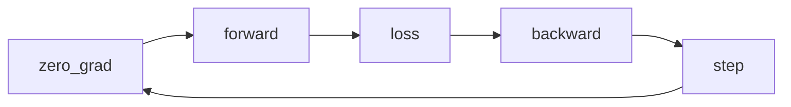

# The training loop



## What changes at each step

| Step | Reads | Changes |
| --- | --- | --- |
| `zero_grad()` | Optimizer parameter list | Clears stored gradients |
| `model(inputs)` | Inputs and parameters | Creates activations and graph |
| `loss_fn(...)` | Logits and targets | Creates scalar objective |
| `loss.backward()` | Computation graph | Accumulates parameter gradients |
| `optimizer.step()` | Parameters and gradients | Updates parameters |

## A reusable epoch function

```python
def train_epoch(model, loader, loss_fn, optimizer, device):
    model.train()
    total_loss = 0.0

    for inputs, targets in loader:
        inputs = inputs.to(device)
        targets = targets.to(device)

        optimizer.zero_grad()
        logits = model(inputs)
        loss = loss_fn(logits, targets)
        loss.backward()
        optimizer.step()

        total_loss += loss.item() * inputs.size(0)

    return total_loss / len(loader.dataset)
```

## Common variations

- Gradient clipping happens after `backward()` and before `step()`.
- Gradient accumulation delays `step()` across multiple micro-batches.
- Mixed precision adds an autocast context and gradient scaler.
- Multiple optimizers require explicit ownership and update order.

The basic loop remains the reference point for understanding those variations.

