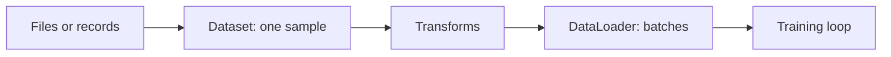

# Dataset, DataLoader, and transforms


The image above is a structural explanation, not a measured experiment. It is useful for locating where a file becomes a tensor and where single samples become batches.

The data pipeline has a deliberate separation of responsibilities:



## Dataset

```python
from torch.utils.data import Dataset

class CustomDataset(Dataset):
    def __init__(self, paths, labels, transform=None):
        self.paths = paths
        self.labels = labels
        self.transform = transform

    def __len__(self):
        return len(self.paths)

    def __getitem__(self, index):
        image = load_image(self.paths[index])
        if self.transform:
            image = self.transform(image)
        return image, self.labels[index]
```

Load samples lazily inside `__getitem__`. Loading the complete dataset into memory is unnecessary for most image projects.

## DataLoader

```python
from torch.utils.data import DataLoader

loader = DataLoader(
    dataset,
    batch_size=32,
    shuffle=True,
    num_workers=4,
    pin_memory=True,
)
```

<div class="batch-lab interactive-panel" data-batch-lab>
  <div class="interactive-heading">Batch calculator</div>
  <label>Samples <input type="number" min="1" value="2100" data-samples></label>
  <label>Batch size <input type="number" min="1" value="32" data-batch-size></label>
  <label class="check-row"><input type="checkbox" data-drop-last> Drop incomplete batch</label>
  <output data-batch-output aria-live="polite"></output>
</div>

## Transforms

```python
from torchvision import transforms

train_transform = transforms.Compose([
    transforms.RandomHorizontalFlip(),
    transforms.RandomRotation(10),
    transforms.ToTensor(),
    transforms.Normalize(mean, std),
])

validation_transform = transforms.Compose([
    transforms.ToTensor(),
    transforms.Normalize(mean, std),
])
```

Random augmentation belongs in training only. Validation must remain stable so results are comparable between epochs.

!!! note "`ToTensor()` is not normalization"
    It converts the image layout to `[channels, height, width]` and normally scales byte pixels to `0–1`. `Normalize(mean, std)` is a separate operation.

## A useful batch inspection

```python
images, labels = next(iter(loader))
print(images.shape, images.dtype)
print(labels.shape, labels.dtype)
print(labels.min(), labels.max())
```

Inspect one batch before defining a model. It catches incorrect shapes, label types, and ranges early.
