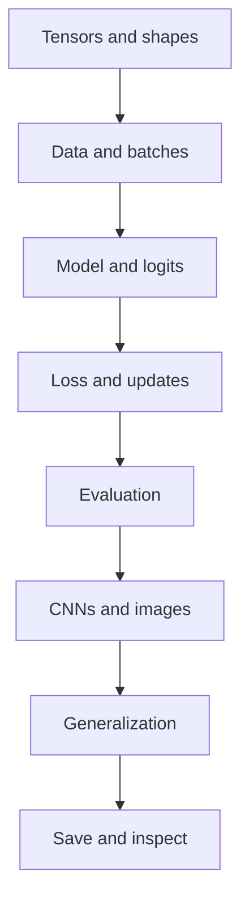

# PyTorch fundamentals: reference map

This map connects the PyTorch ideas that recur across small experiments and image models. It is designed for understanding and recall, not as a course sequence you must complete.

New to PyTorch or returning after a break? Start with the [three-part practical path](../../start/index.md): tensors and a first model, a complete classifier, then CNNs for images. The detailed topics below are the pages to open when you need more than the short explanation.

## What this helps you remember

- Read and debug tensor shapes.
- Build reliable Dataset and DataLoader pipelines.
- Define models with `nn.Module` and `nn.Sequential`.
- Train with a correct gradient-update loop.
- Evaluate without leaking training behavior into validation.
- Diagnose overfitting and shape mismatches.
- Save model parameters and restore them safely.

## How the topics fit together

## Detailed topics

1. [Tensors and autograd](tensors-autograd.md)
2. [Dataset, DataLoader, and transforms](data-pipeline.md)
3. [Models, loss, optimizers, and training](models-training.md)
4. [Validation, evaluation, and metrics](evaluation.md)
5. [Robust real-world pipelines](robust-pipelines.md)
6. [CNNs, modular architectures, and debugging](cnns-debugging.md)
7. [Overfitting and regularization](overfitting.md)
8. [Saving and loading models](saving-models.md)

## Short reminder

Need the essentials now? Open the [quick reference](quick-review.md).

## Original projects

- [Nonlinear regression](../../projects/regression.md)
- [EMNIST letter classifier](../../projects/emnist.md)
- [Robust image pipeline](../../projects/robust-image-pipeline.md)
- [Nature CNN and overfitting](../../projects/nature-cnn.md)

## Source boundary

This is an independent learning reference. The study context is documented in [Sources and attribution](../../about/sources.md); every explanation, example, diagram, and project structure here is original.
