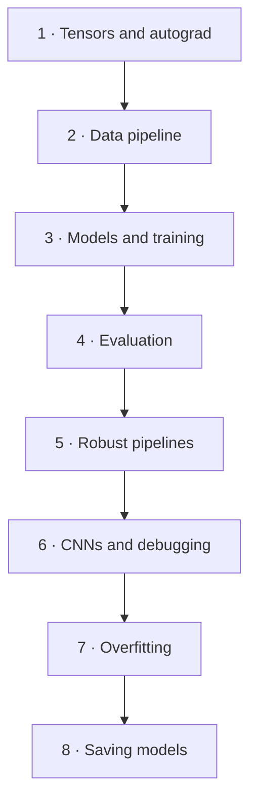

# PyTorch Fundamentals

This collection explains the complete PyTorch workflow from tensors to convolutional neural networks. It is organized around transferable mental models rather than around protected course assessments.

## What you will be able to do

- Read and debug tensor shapes.
- Build reliable Dataset and DataLoader pipelines.
- Define models with `nn.Module` and `nn.Sequential`.
- Train with a correct gradient-update loop.
- Evaluate without leaking training behavior into validation.
- Diagnose overfitting and shape mismatches.
- Save model parameters and restore them safely.

## Module map

## Chapters

1. [Tensors and autograd](tensors-autograd.md)
2. [Dataset, DataLoader, and transforms](data-pipeline.md)
3. [Models, loss, optimizers, and training](models-training.md)
4. [Validation, evaluation, and metrics](evaluation.md)
5. [Robust real-world pipelines](robust-pipelines.md)
6. [CNNs, modular architectures, and debugging](cnns-debugging.md)
7. [Overfitting and regularization](overfitting.md)
8. [Saving and loading models](saving-models.md)

## Short path

Need the essentials now? Open the [10-minute quick review](quick-review.md).

## Original projects

- [Nonlinear regression](../../projects/regression.md)
- [EMNIST letter classifier](../../projects/emnist.md)
- [Robust image pipeline](../../projects/robust-image-pipeline.md)
- [Nature CNN and overfitting](../../projects/nature-cnn.md)

## Source boundary

This is an independent learning reference. It may describe publicly listed topics from the DeepLearning.AI course, but all explanations, examples, diagrams, and project structures here are original. See [Sources and attribution](../../about/sources.md).

