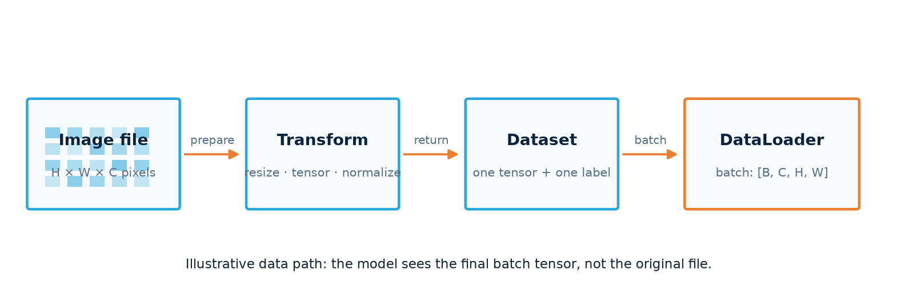
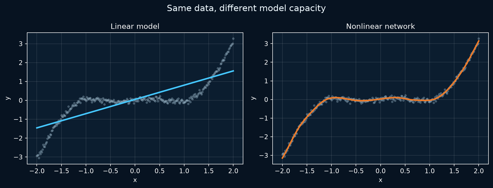

# Fundamentals — core workflow

Follow one path from values in memory to a model you can evaluate. Read it in order once; later, jump straight to the step you need to debug.
{ .page-lead }

**Code key:** “Runnable toy” includes imports and inputs. Other snippets are excerpts: reuse `torch`, `nn`, and the model, loader, tokenizer or helper named in the section. Projects contain the complete runnable scripts.

## What this guide connects

```text
tensor → Dataset → DataLoader → model → output → loss
                                      ↓
                         gradients → optimizer update
                                      ↓
                              validation evidence
```

By the end, you should be able to locate where a batch is created, explain the model's input and output shapes, identify where parameters change, and separate training from evaluation. In classification, the output is often logits; regression usually produces predicted values.

**How to study this page:** for each section, run the tiny example, predict the output shape or value, then check it. The goal is to explain *why* each line exists before memorizing its spelling.


## Tensors, shapes, dtype, and device

<div class="recall-flow" role="group" aria-label="Input to output">
<div><b>Two samples</b><code>x = [[1,2],[3,4]]</code><small>shape [2,2]</small></div>
<div><b>Model</b><code>logits [[2,0],[0,2]]</code><small>w = [[−4,3],[2,−1]]; x @ w.T; targets [0,1]</small></div>
<div><b>Loss</b><code>CE ≈ 0.1269</code><small>one differentiable scalar</small></div>
<div><b>Gradients</b><code>grad = [[.119,.119],[−.119,−.119]]</code><small>backward computes these; weights stay fixed</small></div>
<div><b>Update</b><code>w ← w − 0.1 × grad</code><small>first row becomes [−4.0119, 2.9881]</small></div>
</div>
<p class="visual-caption">Illustrative values: a classifier receives two samples and returns two scores per sample. The cross-entropy shown is calculated from these logits, not a training benchmark.</p>

**Runnable toy — reproduce the flow:**

```python
import torch
x = torch.tensor([[1., 2.], [3., 4.]])
w = torch.tensor([[-4., 3.], [2., -1.]], requires_grad=True)
optimizer = torch.optim.SGD([w], lr=0.1)
loss = torch.nn.functional.cross_entropy(x @ w.T, torch.tensor([0, 1]))
loss.backward()                 # loss ≈ .1269; w.grad ≈ ±.1192
optimizer.step()                # one update; batch axis stays 2
print(loss.item(), w)
```

A tensor is a multidimensional array. Its values are only part of its meaning: **shape**, **dtype**, and **device** are also part of the program.

```python
import torch

x = torch.tensor([[1.0, 2.0], [3.0, 4.0]])
print(x.shape)   # torch.Size([2, 2])
print(x.dtype)   # torch.float32
print(x.device)  # cpu
```

### Read the shape before the layer

A batch keeps one row per sample; image tensors add channel, height and width axes.

??? note "Code and details"
    | Data | Typical shape | Meaning |
    | --- | --- | --- |
    | Tabular batch | `[N, F]` | samples, features |
    | Image batch | `[N, C, H, W]` | samples, channels, height, width |
    | Sequence batch | `[N, L, E]` | samples, sequence length, embedding size |
    | Class logits | `[N, K]` | samples, classes |
    | Segmentation logits | `[N, K, H, W]` | samples, classes, spatial prediction |

    For example, `[32, 3, 224, 224]` means 32 RGB images at 224 × 224 pixels. The first dimension is the batch; it must survive when features are flattened.

    <div class="tensor-lab interactive-panel" data-tensor-lab>
      <div class="interactive-heading">Image tensor reader</div>
      <label>Batch <input type="number" min="1" value="32" data-dim="batch"></label>
      <label>Channels <input type="number" min="1" value="3" data-dim="channels"></label>
      <label>Height <input type="number" min="1" value="224" data-dim="height"></label>
      <label>Width <input type="number" min="1" value="224" data-dim="width"></label>
      <output data-tensor-output aria-live="polite"></output>
    </div>

### Reshape without changing the data

Reshape preserves values and their count. Preserve the batch axis when flattening model inputs. `view` shares storage and needs compatible strides; `reshape` may copy when that layout cannot be viewed.

??? note "Code and details"
    ```python
    x = torch.arange(12).reshape(3, 4)

    x.unsqueeze(0).shape       # [1, 3, 4]
    x.transpose(0, 1).shape    # [4, 3]
    torch.flatten(x).shape      # [12]
    torch.flatten(x, 1).shape   # preserves dimension 0 when x is batched
    ```

    `view` requires a shape compatible with the existing strides and shares storage; it can fail after a transpose. `reshape` returns a view when possible and otherwise copies. Use `contiguous().view(...)` when a contiguous copy is intentional.

    `reshape` changes how compatible values are arranged; it does not add or remove them. `torch.flatten(x, start_dim=1)` preserves the batch boundary.

    For a batch of 16 grayscale 28 × 28 images, a dense classifier needs 784 features per image:

    ```python
    from torch import nn

    images = torch.zeros(16, 1, 28, 28)   # [batch, channels, height, width]
    features = torch.flatten(images, 1)    # [16, 784]; keep the batch axis
    scores = nn.Linear(784, 10)(features)   # [16, 10]; one score per class
    ```

    **Check yourself:** why would `torch.flatten(images)` be wrong here? It would merge all 16 images into one vector and lose which sample each label belongs to.

    `nn.Linear(in_features, out_features)` expects the last input dimension to equal `in_features`:

    ```text
    [N, in_features] × [in_features, out_features] → [N, out_features]
    ```

    If PyTorch reports `mat1 and mat2 shapes cannot be multiplied`, print the tensor immediately before the linear layer.

### Broadcasting

Broadcasting combines compatible shapes without manually copying data. Dimensions are compared from right to left; each pair must be equal or one must be `1`.

```python
batch = torch.ones(4, 3)
bias = torch.tensor([0.1, 0.2, 0.3])
result = batch + bias  # [4, 3]
```

<div class="broadcast-lab interactive-panel" data-broadcast-lab>
  <div class="interactive-heading">Broadcasting checker</div>
  <label>Shape A <input value="4,3" data-shape-a aria-label="First tensor shape"></label>
  <label>Shape B <input value="3" data-shape-b aria-label="Second tensor shape"></label>
  <button type="button" data-check-broadcast>Check shapes</button>
  <output data-broadcast-output aria-live="polite"></output>
</div>

### Tensor operations worth remembering

`cat` joins an existing axis; `stack` creates a new one. Selection, reduction and matrix multiplication have different shape rules.

<div class="recall-flow">
<div><b>cat: join an axis</b><code>[1,2] + [3,4] → [1,2,3,4]</code><small>Two [2] tensors become [4].</small></div>
<div><b>stack: add an axis</b><code>[1,2] + [3,4] → [[1,2],[3,4]]</code><small>Two [2] tensors become [2,2].</small></div>
<div><b>Preserve samples</b><code>[2,1,2,2] → flatten(1) → [2,4]</code><small>flatten() alone gives [8], losing the batch boundary.</small></div>
</div>

??? note "Code and details"

    | Operation | Purpose | Important distinction |
    | --- | --- | --- |
    | `torch.tensor(data)` | create a tensor from values | normally copies input data |
    | `torch.as_tensor(data)` | reuse compatible storage when possible | dtype/device conversion can require a copy |
    | `torch.from_numpy(array)` | wrap a NumPy array | shares its CPU storage; edits can affect both |
    | `zeros`, `ones`, `arange`, `rand` | construct test values | `rand` is uniform; `randn` is Gaussian |
    | `x[:, 0]` / `x[:, 0:1]` | select a feature | `[N]` vs `[N,1]` |
    | `x[mask]` | select matching values | boolean comparisons form the mask |
    | `cat(items, dim)` | join along an existing axis | other dimensions must agree |
    | `stack(items, dim)` | add a new axis | all input shapes must agree |
    | `x * y` / `x @ y` | elementwise / matrix multiplication | different shape rules and meanings |
    | `sum`, `mean`, `std` | summarize values along `dim` | `keepdim=True` preserves broadcast-friendly axes |
    | `permute` / `transpose` | reorder axes | `reshape` does not reorder image channels semantically |
    | `clone` / `detach` | copy storage / stop gradient history | detaching alone still shares storage |
    | `.item()` | get a Python scalar | tensor must contain one value |

    An original feature example connects boolean masks and concatenation:

    ```python
    readings = torch.tensor([[12., 8.], [31., 17.], [24., 12.]])  # temperature, hour
    late = (readings[:, 1] >= 16).float().unsqueeze(1)  # [3,1]
    features = torch.cat([readings, late], dim=1)       # [3,3]
    mean = features.mean(dim=0, keepdim=True)          # [1,3]
    std = features.std(dim=0, keepdim=True, correction=0).clamp_min(1e-6)
    scaled = (features - mean) / std
    ```

    Fit feature statistics on training data and reuse them for new inputs. A engineered feature expresses a hypothesis; validation must show whether it helps. There is no general `torch.from_dataframe` API: convert the selected numeric columns to an array, then use `from_numpy` or `tensor` with the intended dtype.

    **Shape trap:** predictions `[N,1]` and targets `[N]` can broadcast to an unintended `[N,N]` regression error. Match both to `[N,1]` before MSE. `squeeze()` without a dimension can also remove the batch axis when `N=1`; use `squeeze(1)` when only that axis should disappear.

### Dtype and device

Neural-network inputs are normally floating point; single-label class targets for `CrossEntropyLoss` are normally `torch.long`.

??? note "Code and details"
    ```python
    device = torch.device("cuda" if torch.cuda.is_available() else "cpu")
    model = model.to(device)
    inputs = inputs.to(device=device, dtype=torch.float32)
    labels = labels.to(device=device, dtype=torch.long)
    ```

    The model, inputs, targets, and helper tensors used in the same operation must share a device.

    Assign tensor transfers: `x = x.to(device)`. Merely calling `x.to(device)` and discarding its result does not change `x`'s reference. Move the model to its intended device before creating its optimizer.

    **Next:** see shape, device, autograd, and nonlinearity together in [nonlinear regression](../../projects/regression.md).

## Dataset, transforms, and DataLoader



The diagram is structural, not a measured experiment. It shows where a file becomes a tensor and where samples become a batch.

| Part | Owns | Produces |
| --- | --- | --- |
| `Dataset` | locating and preparing one valid example | `(input, label)` |
| transforms | deterministic preparation or training-only augmentation | a model-ready tensor |
| `DataLoader` | batching, order, parallel loading | batches of examples |
| training loop | device transfer and model updates | loss history and changed parameters |

### Dataset: one sample

??? note "Implementation excerpt · requires the objects described above"
    ```python
    from torch.utils.data import Dataset

    class CustomDataset(Dataset):
        def __init__(self, paths, labels, transform=None):
            self.paths = paths
            self.labels = labels
            self.transform = transform

        def __len__(self):
            return len(self.paths)

        def __getitem__(self, index):
            image = load_image(self.paths[index])
            if self.transform:
                image = self.transform(image)
            return image, self.labels[index]
    ```


Load lazily in `__getitem__`; most image projects should not put the complete dataset in memory.

### Transforms: prepare consistently

Transforms convert individual inputs into the shape and range expected by the model.

??? note "Code and details"
    ```python
    from torchvision import transforms

    train_transform = transforms.Compose([
        transforms.RandomHorizontalFlip(),
        transforms.RandomRotation(10),
        transforms.ToTensor(),
        transforms.Normalize(mean, std),
    ])

    validation_transform = transforms.Compose([
        transforms.ToTensor(),
        transforms.Normalize(mean, std),
    ])
    ```

    Random, label-preserving augmentation belongs in training only. Validation must be stable between epochs. `ToTensor()` changes layout to `[C, H, W]` and normally scales byte pixels to `0–1`; normalization is a separate operation.

    `mean` and `std` above must come from training data (or a documented pretrained model's expected preprocessing). Use the **same** fixed normalization for validation; fitting it on validation would leak information into training decisions. A horizontal flip is safe only when it preserves the label for your task: it can change the meaning of some symbols or medical images.

### DataLoader: samples become batches

A loader groups samples and controls their order, worker processes and final incomplete batch.

??? note "Code and details"
    ```python
    from torch.utils.data import DataLoader

    train_loader = DataLoader(
        train_dataset,
        batch_size=32,
        shuffle=True,
        num_workers=4,
        pin_memory=torch.cuda.is_available(),
    )
    ```

    <div class="batch-lab interactive-panel" data-batch-lab>
      <div class="interactive-heading">Batch calculator</div>
      <label>Samples <input type="number" min="1" value="2100" data-samples></label>
      <label>Batch size <input type="number" min="1" value="32" data-batch-size></label>
      <label class="check-row"><input type="checkbox" data-drop-last> Drop incomplete batch</label>
      <output data-batch-output aria-live="polite"></output>
    </div>

    Inspect one batch before defining the model:

    ```python
    images, labels = next(iter(train_loader))
    print(images.shape, images.dtype, images.min(), images.max())
    print(labels.shape, labels.dtype, labels.min(), labels.max())
    ```

    This catches a surprising shape, incorrect label dtype, or wrong class range before a long run.

    **Next:** use the [robust image-pipeline project](../../projects/robust-image-pipeline.md) to see validation, corrupt-file reporting, batching, and artifacts together.

## Models, activations, and logits

An `nn.Module` owns registered layers and parameters and defines how an input becomes an output.

```python
from torch import nn

class Classifier(nn.Module):
    def __init__(self, input_features: int, classes: int):
        super().__init__()
        self.network = nn.Sequential(
            nn.Linear(input_features, 128),
            nn.ReLU(),
            nn.Linear(128, classes),
        )

    def forward(self, x):
        return self.network(x)  # [batch, classes]
```

- `__init__` creates reusable layers and registers their parameters.
- `forward` describes the transformation.
- `model(x)` is the normal call; it preserves hooks and PyTorch internals.
- The output is raw **logits**, one score per class.

### Why activations matter

Nonlinear activations let stacked layers represent curves and more complex decision boundaries.

??? note "Code and details"
    ```python
    linear = nn.Linear(1, 1)

    nonlinear = nn.Sequential(
        nn.Linear(1, 32),
        nn.Tanh(),
        nn.Linear(32, 1),
    )
    ```

    Try the activation by itself:

    ```python
    values = torch.tensor([-2.0, 0.0, 3.0])
    print(nn.ReLU()(values))  # tensor([0., 0., 3.])
    ```

    `ReLU(x) = max(0, x)`: it replaces a **negative intermediate input** with zero and leaves a positive input unchanged. It does *not* make values negative. A later linear output layer can still produce a negative prediction. Its zero side and sloped side let different hidden units switch on in different regions.

    ```python
    model = nn.Sequential(
        nn.Linear(1, 3),  # one distance → three learned hidden values
        nn.ReLU(),        # zero negative hidden values; create a bend
        nn.Linear(3, 1),  # combine them into one prediction
    )
    ```

    In the course's delivery-time lab, a single line could not follow a curved relationship; adding hidden units and an activation let the model express bends. If you remove `ReLU`, consecutive `Linear` layers collapse to one affine map, however many you stack. `Tanh` is another nonlinear choice, with a smooth output between −1 and 1. **Check yourself:** in this model, which layer can make the final prediction negative? The last `Linear` layer.

    

    This chart is reproduced by the retained regression script with a fixed seed. It demonstrates model capacity, not a general benchmark.

### Logits, probabilities, and predictions

For single-label multiclass classification:

```python
logits = model(inputs)                 # [batch, classes]
loss = nn.CrossEntropyLoss()(logits, labels)
predictions = logits.argmax(dim=1)    # [batch]
probabilities = logits.softmax(dim=1) # only when probabilities are needed
```

Do not apply softmax before `CrossEntropyLoss`; the loss already combines the stable operations it needs.

### Match the output, target and loss

Choose the loss from the task, then match its required output and target shapes and types.

??? note "Code and details"
    | Task | Output / target | Common loss |
    | --- | --- | --- |
    | Numeric regression | matching floating shapes | `MSELoss` (squares errors), `L1Loss` (absolute errors) |
    | Robust numeric regression | matching floating shapes | `SmoothL1Loss`, less dominated by large errors than MSE |
    | One class per sample | logits `[N,K]`, long class IDs `[N]` | `CrossEntropyLoss` |
    | Binary / independent multilabel | logits and float targets with the same shape | `BCEWithLogitsLoss`; sigmoid only for interpretation |
    | Already computed log probabilities | log probabilities `[N,K]`, long targets `[N]` | `NLLLoss`, often paired with `LogSoftmax` |

    `Sigmoid` outputs `0..1`; `Tanh` outputs `-1..1`; `LeakyReLU` keeps a small negative slope; `Softmax(dim=1)` normalizes mutually exclusive class scores. Choose output behavior for the task, rather than inserting an activation after every layer. MSE and cross-entropy use different scales; their raw values are not comparable measures of model quality. `SmoothL1Loss` and `HuberLoss` are related but differ in scaling/parameterization.

    **Next:** the [EMNIST project](../../projects/emnist.md) compares a dense classifier with a CNN and produces predictions, curves, metrics, and a checkpoint.

## Loss, autograd, and optimizers


Loss turns model behavior into one differentiable scalar. Autograd follows the operations that produced it, and the optimizer uses the resulting gradients to update parameters.

```python
w = torch.tensor(2.0, requires_grad=True)
x = torch.tensor(3.0)
y = (w * x) ** 2
y.backward()
print(w.grad)
```

Gradients accumulate by default. That is why each independent update clears old gradients before backpropagation.

In the scalar example, `w.grad` is 36: `d(9w²)/dw = 18w` at `w=2`. `backward()` calculates this derivative; it does not change `w`. Plain SGD subsequently performs `w ← w - lr × gradient`. Momentum uses an accumulated direction, while Adam adapts updates using gradient statistics; neither chooses a suitable learning rate for you.

PyTorch builds the autograd graph from the operations actually executed during a forward pass. Ordinary Python branches and loops can participate. `nn.Sequential` is a registered ordered chain, not a separate static-graph framework; inspect its children or attach hooks when you need intermediate values.

### The complete training loop

Clear gradients, predict, calculate loss, accumulate gradients, then update the parameters.

??? note "Code and details"
    <div class="training-stepper interactive-panel" data-training-stepper>
      <div class="interactive-heading">Training-loop stepper</div>
      <ol>
        <li data-train-step="0">Clear old gradients</li>
        <li data-train-step="1">Run the forward pass</li>
        <li data-train-step="2">Measure the loss</li>
        <li data-train-step="3">Backpropagate gradients</li>
        <li data-train-step="4">Update parameters</li>
      </ol>
      <div class="stepper-actions">
        <button type="button" data-step-prev>Previous</button>
        <button type="button" data-step-next>Next</button>
      </div>
      <output data-step-output aria-live="polite"></output>
    </div>

    ```python
    def train_epoch(model, loader, loss_fn, optimizer, device):
        model.train()
        total_loss = 0.0
        samples_seen = 0

        for inputs, labels in loader:
            inputs = inputs.to(device)
            labels = labels.to(device)

            optimizer.zero_grad(set_to_none=True)
            logits = model(inputs)
            loss = loss_fn(logits, labels)
            loss.backward()
            optimizer.step()

            total_loss += loss.item() * inputs.size(0)
            samples_seen += inputs.size(0)

        return total_loss / samples_seen
    ```

    | Step | Reads | Changes |
    | --- | --- | --- |
    | `zero_grad()` | optimizer parameter list | clears stored gradients |
    | `model(inputs)` | inputs and parameters | creates activations and the computation graph |
    | `loss_fn(...)` | logits and targets | creates the scalar objective |
    | `loss.backward()` | computation graph | accumulates parameter gradients |
    | `optimizer.step()` | parameters and gradients | updates parameters |

    ```python
    optimizer = torch.optim.Adam(model.parameters(), lr=1e-3)
    ```

    A learning rate that is too high can make loss unstable; one that is too low can make progress impractically slow. Before a full run, try to overfit one small batch. If loss cannot fall, inspect labels, loss pairing, gradients, and optimizer ownership.

    This training function assumes an unweighted per-sample mean loss and a non-empty loader. For class-index cross-entropy with class weights, aggregate the sum of weighted losses and divide by the sum of the selected target weights (excluding ignored labels). Multiplying a weighted batch mean by batch size does not recover that denominator. This denominator applies to class-index targets; probability targets use a different mean reduction. [CrossEntropyLoss contract](https://docs.pytorch.org/docs/2.14/generated/torch.nn.CrossEntropyLoss.html).

Advanced variations keep this basic order: gradient clipping goes after `backward()` and before `step()`; accumulation delays `step()`; mixed precision wraps the forward/loss work and scales gradients.

## Validation and metrics

Evaluation uses the same model without updating its parameters.

??? note "Implementation excerpt · requires the objects described above"
    ```python
    def evaluate(model, loader, device):
        model.eval()
        correct = 0
        total = 0

        with torch.no_grad():
            for inputs, labels in loader:
                inputs = inputs.to(device)
                labels = labels.to(device)
                logits = model(inputs)
                predictions = logits.argmax(dim=1)
                correct += (predictions == labels).sum().item()
                total += labels.size(0)

        return correct / total
    ```


`model.eval()` changes dropout and batch-normalization behavior. `torch.no_grad()` disables gradient tracking and reduces memory use. Use both; neither computes a metric by itself.

Notice what evaluation leaves out: there is no `zero_grad()`, `backward()`, or `step()`. Validation measures the current weights; it must not train on the answers it is supposed to check.

### Choose evidence for the question

Aggregate validation results across samples; inspect class-level errors when accuracy hides failures.

??? note "Code and details"
    | Metric | Useful when | Limitation |
    | --- | --- | --- |
    | Accuracy | classes are reasonably balanced | can hide minority-class failure |
    | Precision | false positives are costly | ignores missed positives |
    | Recall | false negatives are costly | ignores false alarms |
    | F1 | precision and recall both matter | averages can hide class-specific failure |
    | Confusion matrix | you need the structure of mistakes | requires inspection, not one scalar |

    For unweighted per-sample loss with mean reduction, weight epoch loss by sample count so a smaller final batch does not count like a full batch. Divide by the number of samples actually processed if `drop_last=True` or a custom sampler skips examples:

    ```python
    running_loss += loss.item() * inputs.size(0)
    epoch_loss = running_loss / samples_seen
    ```

### Prevent leakage

- Split before fitting data-dependent preprocessing.
- Keep class-to-index mapping identical across splits.
- Do not apply random training augmentation to validation.
- Tune with validation, not repeatedly with the final test set.
- Select a checkpoint using validation behavior; evaluate on test once.

## Core-workflow checklist

Before trusting a run, answer these questions:

1. What does each input dimension mean?
2. Are input, target, and parameters on the same device?
3. Does the Dataset return one valid sample and label?
4. Do model outputs have shape `[batch, classes]`?
5. Does the loss match the output and target representation?
6. Are gradients cleared, calculated, and applied in the intended order?
7. Does evaluation use stable data, `eval()`, and no gradients?
8. Can the pipeline overfit one tiny batch?

Continue with [Fundamentals — vision and real data](vision-real-data.md), where the same workflow is applied to images, CNNs, imperfect files, and generalization. Once that path is clear, [metrics and tuning](../training/training-quality.md) explains the next choices without changing the loop's purpose.
