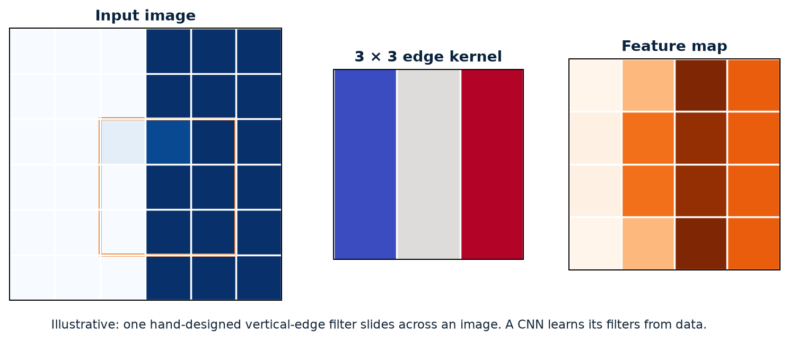
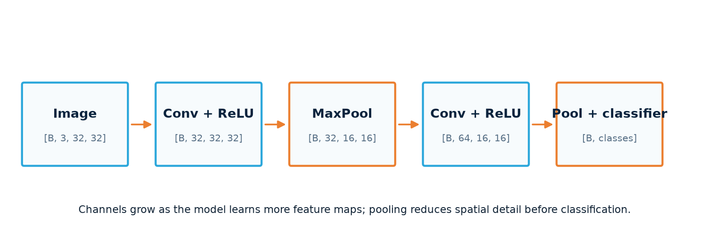

# Fundamentals — vision and real data

Apply the core workflow to images: trace shapes through a CNN, check the files before training, then decide whether validation evidence supports the model.
{ .page-lead }

## What this guide connects

```text
image files → validated samples → augmented training batches
                                      ↓
                         convolutional feature maps
                                      ↓
                           [batch, classes] logits
                                      ↓
                 validation curves + error inspection
                                      ↓
                    reproducible checkpoint and context
```

Read [Fundamentals — core workflow](core-workflow.md) first if Dataset, logits, loss, or the training update order are unfamiliar.

**Study target:** after each section, name the input, output, and reason for the operation. A CNN is the same training loop as before; the important new questions are spatial shape, file quality, and generalization.

| Section | Main question | Useful next example |
| --- | --- | --- |
| [Convolution and feature maps](#convolution-and-feature-maps) | How does a CNN look for local patterns? | [EMNIST](../../projects/emnist.md) |
| [CNN architecture and shapes](#cnn-architecture-and-shapes) | Where do channels grow and spatial dimensions shrink? | [Nature CNN](../../projects/nature-cnn.md) |
| [Reliable image data](#reliable-image-data) | What must be true before a metric is trustworthy? | [Robust pipeline](../../projects/robust-image-pipeline.md) |
| [Generalization and regularization](#generalization-and-regularization) | Is the model learning a reusable pattern or memorizing? | [Learning curves](#read-learning-curves) |
| [Saving and restoring](#saving-and-restoring) | What must be retained to use the model again? | [Reference](../../reference/index.md) |

## Convolution and feature maps

A dense layer sees one long list of pixels. A convolution keeps the spatial layout and applies the same small kernel at many positions. Reusing weights makes it efficient and allows one learned pattern to be recognized in different locations.



The pictured filter is hand-designed to make its response visible. A trained CNN learns its kernel values through backpropagation.

<div class="kernel-lab interactive-panel" data-kernel-lab>
  <div class="interactive-heading">3 × 3 kernel explorer</div>
  <div class="kernel-controls">
    <label>Kernel
      <select data-kernel-select>
        <option value="edge">Vertical edge</option>
        <option value="horizontal">Horizontal edge</option>
        <option value="sharpen">Sharpen</option>
        <option value="blur">Box blur</option>
      </select>
    </label>
    <button type="button" data-randomize-grid>Randomize input</button>
  </div>
  <div class="kernel-stage">
    <div><strong>Input</strong><div class="matrix-grid" data-input-grid></div></div>
    <div><strong>Kernel</strong><div class="matrix-grid kernel-grid" data-kernel-grid></div></div>
    <div><strong>Valid output</strong><div class="matrix-grid output-grid" data-output-grid></div></div>
  </div>
  <output data-kernel-output aria-live="polite"></output>
</div>

### Channels

```python
nn.Conv2d(
    in_channels=3,
    out_channels=32,
    kernel_size=3,
    padding=1,
)
```

Each of the 32 learned filters spans all three RGB input channels. The result is 32 feature maps—not 32 colours. Early filters may respond to edges, colour transitions, or texture; deeper layers combine those maps into patterns useful for the task.

Try one layer with a small batch:

```python
from torch import nn
images = torch.zeros(4, 3, 32, 32)      # four RGB images
conv = nn.Conv2d(3, 8, 3, padding=1)    # learn eight 3 × 3 filters
maps = conv(images)
print(maps.shape)                       # [4, 8, 32, 32]
```

The batch count stays 4; the filter count sets output channels to 8. Padding keeps 32 × 32 here. **Check yourself:** what changes if `padding=0`? The spatial output becomes 30 × 30.

### Kernel size, stride, and padding

- **Kernel size** controls the local window inspected at once.
- **Stride** controls how far the kernel moves between positions.
- **Padding** adds a border so edge pixels participate and output size can be controlled.
- **Dilation** spaces kernel elements apart to expand the receptive field.

For one spatial dimension:

```text
output = floor((input + 2 × padding − dilation × (kernel − 1) − 1) / stride + 1)
```

A `3 × 3` convolution with padding `1`, stride `1`, and dilation `1` preserves height and width.

## CNN architecture and shapes



The values in the diagram are an illustrative shape trace. Always inspect the real input and real model.

```text
[batch, 3, 32, 32]
  → convolution: channels grow
  → pooling or stride: width and height shrink
  → classifier: [batch, classes]
```

### A reusable block

```python
class CNNBlock(nn.Module):
    def __init__(self, in_channels, out_channels):
        super().__init__()
        self.block = nn.Sequential(
            nn.Conv2d(in_channels, out_channels, 3, padding=1),
            nn.BatchNorm2d(out_channels),
            nn.ReLU(),
            nn.MaxPool2d(2),
        )

    def forward(self, x):
        return self.block(x)
```

Convolution learns local features, ReLU adds nonlinearity, normalization stabilizes intermediate distributions, and pooling reduces spatial resolution.

Trace this block on `[4, 3, 32, 32]`: convolution gives `[4, 8, 32, 32]`; batch normalization and ReLU keep that shape; `MaxPool2d(2)` gives `[4, 8, 16, 16]`. Pooling keeps the strongest value in each 2 × 2 window. It reduces detail and compute, so excessive pooling can discard information. Batch normalization tracks statistics during training and uses stored statistics in evaluation; that is one reason `model.eval()` matters.

<div class="shape-tracer interactive-panel" data-shape-tracer>
  <div class="interactive-heading">CNN shape tracer</div>
  <label>Input size <input type="number" min="8" value="32" data-spatial-size></label>
  <label>Pooling blocks <input type="number" min="0" max="6" value="3" data-pool-blocks></label>
  <button type="button" data-trace-shape>Trace</button>
  <output data-shape-output aria-live="polite"></output>
</div>

### Safer classifier boundaries

Hard-coded flatten sizes break when input resolution or feature blocks change. Prefer adaptive pooling when spatial position no longer needs to be preserved:

```python
self.features = nn.Sequential(
    CNNBlock(3, 32),
    CNNBlock(32, 64),
    nn.AdaptiveAvgPool2d((1, 1)),
)
self.classifier = nn.Linear(64, classes)

def forward(self, x):
    x = self.features(x)
    x = torch.flatten(x, 1)
    return self.classifier(x)
```

When a fixed feature size is intentional, inspect it with a dummy input rather than calculating it mentally:

```python
with torch.no_grad():
    features = self.features(torch.zeros(1, 3, 32, 32))
print(features.shape)
```

### Trace the first unexpected shape

```python
def show_shape(name):
    def hook(module, inputs, output):
        print(name, tuple(output.shape))
    return hook

handle = model.features.register_forward_hook(show_shape("features"))
# run one batch, then remove the temporary hook
handle.remove()
```

Most shape failures are easier to understand at the first incorrect boundary than at the final linear-layer error.

**Next:** compare a dense model with a CNN in [EMNIST](../../projects/emnist.md), then inspect a modular regularized model in [Nature CNN](../../projects/nature-cnn.md).

## Reliable image data

A larger architecture cannot repair inconsistent labels, leakage, corrupt files, or transforms applied to the wrong split.

### Establish the data contract before training

1. Define stable class names and a class-to-index mapping.
2. Verify file existence, extension, readability, colour mode, and expected input shape.
3. Record rejected files with their path and reason.
4. Split with a fixed seed before applying random augmentation.
5. Inspect class counts in each split.
6. Keep validation preprocessing deterministic.
7. Split related entities together so near-duplicates cannot leak across sets.

```python
from PIL import Image

def open_rgb(path):
    with Image.open(path) as image:
        return image.convert("RGB")
```

### Handle failures deliberately

Do not recursively request another sample from `__getitem__` without a strict limit; a cluster of corrupt files can create infinite recursion. Prefer validating the index before training. When runtime filtering is required, return a controlled sentinel and use a custom `collate_fn`.

```python
def collate_valid(batch):
    valid = [sample for sample in batch if sample is not None]
    if not valid:
        raise RuntimeError("Batch contains no valid samples")
    return torch.utils.data.default_collate(valid)
```

### Make splits reproducible

```python
generator = torch.Generator().manual_seed(42)
train_set, validation_set = random_split(
    dataset,
    [train_size, validation_size],
    generator=generator,
)
```

Record the split seed and per-class distribution. For multiple images of the same person, object, location, or capture burst, split by entity rather than individual image. `random_split` by itself does not prevent that kind of leakage.

**Check yourself:** if two crops of the same photo land in different splits, validation can reward recognition of that photo rather than a pattern that works on new photos. Group them before splitting.

### Monitor data, not only the model

- Samples and rejected files per class.
- Pixel range after transforms.
- Label dtype and minimum/maximum values.
- Batch loading time and accelerator idle time.
- Class mapping stored with the run.
- Example transformed images from both training and validation.

The [robust image-pipeline project](../../projects/robust-image-pipeline.md) downloads public data, builds a folder dataset, adds one known corrupt file, records the validation decision, and trains only on valid examples.

## Generalization and regularization

Generalization asks whether patterns learned from training examples remain useful on unseen data from the intended environment.

### Read learning curves

<div class="curve-lab interactive-panel" data-curve-lab>
  <div class="interactive-heading">Learning-curve comparison</div>
  <label>Illustrative regularization strength <input type="range" min="0" max="100" value="35" data-regularization></label>
  <canvas width="720" height="260" data-curve-canvas aria-label="Illustrative training and validation loss curves"></canvas>
  <output data-curve-output aria-live="polite"></output>
  <small>Illustrative curves—not measured benchmark results.</small>
</div>

| Observation | Likely issue | First checks |
| --- | --- | --- |
| Training and validation both poor | underfitting or broken pipeline | labels, loss, learning rate, capacity |
| Training improves; validation worsens | overfitting | split quality, augmentation, regularization |
| Loss becomes NaN | numerical instability | invalid inputs, learning rate, gradients |
| High total accuracy; one class fails | imbalance or shortcut learning | per-class recall and confusion matrix |

### Four gaps to inspect

1. **Training–validation gap:** has the model fitted training-specific detail?
2. **Validation–deployment gap:** does validation represent real inputs?
3. **Aggregate–class gap:** does one headline metric hide weak classes?
4. **Accuracy–cost gap:** is an improvement worth the memory, latency, and complexity?

A model can improve on a standard held-out set and still fail on an external source. Report both domains instead of treating one as the universal truth.

### Regularization tools

**Data augmentation** creates realistic label-preserving variation. An upside-down vehicle or severely distorted character may not preserve the label.

**Weight decay** discourages unnecessarily large weights:

```python
optimizer = torch.optim.AdamW(
    model.parameters(),
    lr=1e-3,
    weight_decay=1e-4,
)
```

**Dropout** randomly removes activations during training:

```python
self.dropout = nn.Dropout(0.3)
```

It is active in `model.train()` and disabled in `model.eval()`.

**Early stopping** keeps the checkpoint associated with the best validation behavior instead of assuming the final epoch is best.

Change one hypothesis at a time. Use the same split, seed, metrics, and evaluation procedure so an apparent gain does not come from changing the test.

If training loss falls while validation loss rises, first inspect the split and the mistakes. Then try one change, such as realistic augmentation, weight decay, or a smaller model. Dropout is a training-time source of noise; it is not a repair for incorrect labels or leakage.

## Saving and restoring

### Save model parameters

```python
torch.save(model.state_dict(), "model.pth")
```

Restore them into the same architecture:

```python
model = Classifier(classes=len(class_names))
state = torch.load("model.pth", map_location=device, weights_only=True)
model.load_state_dict(state)
model.to(device)
model.eval()
```

### Save a training checkpoint

```python
torch.save({
    "epoch": epoch,
    "model_state": model.state_dict(),
    "optimizer_state": optimizer.state_dict(),
    "validation_loss": validation_loss,
    "class_names": class_names,
    "input_shape": input_shape,
    "normalization": normalization,
}, "checkpoint.pth")
```

A usable model is more than its tensors. Retain architecture code, preprocessing, class order, input shape, selected metric, split identity, seed, and package versions. Verify the restored model on a known input.

Never load an untrusted pickle-based checkpoint. Prefer weight-only loading when the saved format and installed PyTorch version support it.

## Vision-workflow checklist

Before trusting an image model, confirm:

1. Files, labels, classes, and splits were validated before training.
2. Training and validation transforms differ only where intended.
3. Every CNN boundary has a known shape.
4. The classifier produces `[batch, classes]` logits.
5. Metrics include error structure, not only one average.
6. Training and validation curves are interpreted together.
7. The selected checkpoint can be restored with its preprocessing and class order.

Use the [project gallery](../../projects/index.md) to move from these patterns to complete, runnable examples, or open the [reference](../../reference/index.md) when debugging a specific run.
