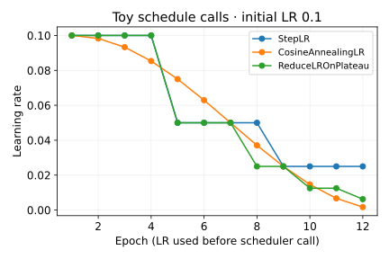

# Training — metrics and tuning

Once the [basic training loop](../fundamentals/core-workflow.md#the-complete-training-loop) works, the question changes: which settings improve the result, and what evidence makes the comparison fair?
{ .page-lead }

**Read in order:** choose a metric → establish a baseline → tune the learning rate → schedule it → search a few settings → compare quality and cost. For faster execution of the same experiment, continue with [efficient training](efficient-training.md).


**Code key:** “Runnable toy” includes imports and inputs. Other snippets are excerpts: reuse `torch`, `nn`, and the model, loader, tokenizer or helper named in the section. Projects contain the complete runnable scripts.

## Metrics that answer the right question

<div class="interactive-panel" data-metrics-lab>
  <div class="interactive-heading">Inspection outcomes → metrics</div>
  <p>Positive means “defect”. Rows are truth; columns are predictions.</p>
  <div class="metrics-inputs">
    <label>True positives <input type="number" min="0" value="8" data-tp></label>
    <label>False positives <input type="number" min="0" value="2" data-fp></label>
    <label>False negatives <input type="number" min="0" value="2" data-fn></label>
    <label>True negatives <input type="number" min="0" value="88" data-tn></label>
  </div>
  <button type="button" data-metric-preset>Try always predicting “good”</button>
  <div data-metric-matrix></div><output data-metric-output aria-live="polite"></output>
  <small>Exact arithmetic on editable counts; no trained detector.</small>
</div>

The **loss** is the differentiable quantity used to train. A **metric** describes behavior you care about. Lower cross-entropy and higher accuracy often move together, but they are different measurements.

For one positive class, imagine an inspection system:

| Outcome | Meaning |
| --- | --- |
| TP | a defect was correctly flagged |
| FP | a good item was flagged |
| FN | a defect was missed |
| TN | a good item was correctly accepted |

```text
accuracy  = (TP + TN) / all samples
precision = TP / (TP + FP)        how trustworthy are the alarms?
recall    = TP / (TP + FN)        how many defects did we find?
F1        = 2 × precision × recall / (precision + recall)
```

If 99 of 100 items are good, always predicting “good” gives 99% accuracy and zero defect recall. F1 does not include true negatives, and no metric removes the need to inspect actual mistakes. A confusion matrix shows **which classes get confused**; state whether rows represent true or predicted classes.

### Average over the dataset

In multiclass work, **macro** gives every class equal weight; **weighted** weights classes by support; **micro** pools the underlying counts. For ordinary single-label multiclass predictions over all classes, micro precision, recall and F1 equal accuracy. Macro F1 is the average of per-class F1 values, not F1 calculated from macro precision and recall.

??? note "Code and details"
    This excerpt needs TorchMetrics, an existing model, validation loader and device:

    ```python
    from torchmetrics.classification import MulticlassF1Score

    metric = MulticlassF1Score(num_classes=classes, average="macro").to(device)
    model.eval()
    with torch.no_grad():
        for x, y in validation_loader:
            logits = model(x.to(device))
            metric.update(logits.argmax(1), y.to(device))
    macro_f1 = metric.compute().item()
    metric.reset()  # do this before measuring the next epoch with the same object
    ```

    Use `MulticlassAccuracy`, `MulticlassPrecision`, `MulticlassRecall` and `MulticlassConfusionMatrix` similarly. `update()` accumulates counts; `compute()` summarizes them; `reset()` starts a new measurement. Averaging individual batch F1 values is generally incorrect. Keep separate state for training and validation.

## What each hyperparameter changes

**Parameters** are learned weights and biases. **Hyperparameters** are choices you set around that learning process.

| Choice | What changes | Watch for |
| --- | --- | --- |
| `lr` | size of optimizer updates | divergence when high; slow learning when low |
| optimizer | update rule: SGD, momentum, Adam/AdamW | each rule needs its own LR comparison |
| `batch_size` | samples per update, memory and gradient variability | more throughput does not guarantee better validation |
| epochs | data passes / training budget | the final epoch may overfit |
| blocks / channels / hidden width | representation capacity and compute | more layers can shrink images too far |
| kernel size | spatial window per convolution | padding and feature shapes must remain valid |
| dropout `p` | fraction of activations dropped during training | excessive dropout can cause underfitting |
| `weight_decay` | pressure against large weights | AdamW decouples it from the adaptive gradient update |
| BatchNorm | learned scaling plus running statistics | behavior depends on training mode and microbatch size |
| early stopping patience | how long to wait without useful improvement | counts validation checks, not universally epochs |

Try a small logarithmic LR range first, for example `1e-4`, `1e-3`, `1e-2`. These are experiment candidates, not universal defaults. Compare the same split, initialization policy, training budget and metric. Change one hypothesis at a time before widening the search.

## Learning-rate schedulers

{ width="432" height="288" }

Toy execution: StepLR halves LR every four calls; cosine spans 12 epochs; plateau responds to the declared validation-loss signal `[1, .8, .8, .8, .7, .7, .7, .7, .7, .7, .7, .7]` with patience 1. The chart shows LR used before each end-of-epoch scheduler call. This is a schedule comparison, not measured model training. [Calls and values](../../assets/data/recall-2026-10-01/schedules.json).

<div class="recall-flow" role="group" aria-label="Input to output">
<div><b>StepLR</b><code>0.001 → 0.0005 → 0.00025</code><small>drop after every 4 epoch calls</small></div>
<div><b>Cosine</b><code>high → smooth low</code><small>T_max counts schedule calls</small></div>
<div><b>Plateau</b><code>validate → compare → maybe reduce</code><small>patience waits for non-improving checks</small></div>
</div>
<p class="visual-caption">Illustrative schedules. A short improving run may never trigger a plateau reduction. Log LR used before the step and LR next afterward.</p>

An optimizer changes weights; a scheduler changes the optimizer's LR. It cannot repair wrong labels or leakage.

| Scheduler | Key parameters | Call it… |
| --- | --- | --- |
| `StepLR` | `step_size`, `gamma` | after updates at each chosen interval |
| `CosineAnnealingLR` | `T_max`, `eta_min` | after updates; `T_max` counts scheduler calls |
| `ReduceLROnPlateau` | `mode`, `factor`, `patience`, `threshold` | after validation with the monitored value |

For an **epoch-based** schedule:

```python
optimizer = torch.optim.AdamW(model.parameters(), lr=1e-3)
scheduler = torch.optim.lr_scheduler.StepLR(optimizer, step_size=4, gamma=0.5)
for epoch in range(epochs):
    train_epoch(model, train_loader, loss_fn, optimizer, device)
    validation_loss = validate_epoch(model, validation_loader)
    used_lr = optimizer.param_groups[0]["lr"]
    scheduler.step()  # changes the rate for the next epoch
```

Here `train_epoch` and `validate_epoch` are your training/evaluation functions. With this schedule, the first four epochs use `1e-3`, the next four `5e-4`, then `2.5e-4`. `get_last_lr()` returns the scheduler's latest rates; logging before or after the step describes different epochs.

Plateau scheduling needs a matching direction:

```python
scheduler = torch.optim.lr_scheduler.ReduceLROnPlateau(
    optimizer, mode="min", factor=0.5, patience=2,
)
scheduler.step(validation_loss)  # once after each validation measurement
# For accuracy/F1 instead: mode="max", then step(validation_score).
```

**Common trap:** changing an epoch-based call to every batch silently speeds up the schedule. Early stopping and plateau scheduling also have different jobs: one ends training; the other lowers LR and continues.

## A small Optuna search

**Trial:** one proposed configuration and its measurement. **Objective:** your function that trains/evaluates that configuration and returns a scalar. **Study:** the collection of trials and its optimization direction.

The structure below requires Optuna and your own `fit_and_validate` function. Each call must build a **fresh model and optimizer**, use the same data split, and return validation macro F1:

??? note "Implementation excerpt · requires the objects described above"
    ```python
    import optuna

    def objective(trial):
        settings = {
            "lr": trial.suggest_float("lr", 1e-4, 1e-2, log=True),
            "width": trial.suggest_int("width", 16, 64, step=16),
            "dropout": trial.suggest_float("dropout", 0.0, 0.4),
            "kernel": trial.suggest_categorical("kernel", [3, 5]),
        }
        score, seconds = fit_and_validate(settings)
        trial.set_user_attr("training_seconds", seconds)
        return score

    study = optuna.create_study(
        direction="maximize", sampler=optuna.samplers.TPESampler(seed=17),
    )
    study.optimize(objective, n_trials=12)
    print(study.best_params, study.best_value)
    table = study.trials_dataframe()
    ```


`suggest_int` chooses discrete integers; `suggest_float(log=True)` searches orders of magnitude; `suggest_categorical` chooses named options. If the objective is loss, use `direction="minimize"`.

Grid search exhausts listed combinations; random search samples without learning from scores; TPE uses earlier trials to guide later proposals. A short search has noisy evidence. `optuna.visualization.plot_optimization_history(study)`, `plot_param_importances(study)` and `plot_parallel_coordinate(study)` help explore completed trials; their plotting dependencies are optional. Those plots do not establish causation or a global optimum. Recheck promising settings across seeds.

### Flexible models must register every layer

Use `nn.Sequential(*blocks)` for an ordered chain or `nn.ModuleList(blocks)` when your `forward` chooses how to use registered blocks. A plain Python list does not register layers with the parent model.

If a classifier is created on its first forward pass, run a representative dummy input **before** constructing the optimizer, with the model on the intended device. Otherwise the optimizer can miss those new parameters. Prefer constructing the head in `__init__` using adaptive pooling when practical. [Model inspection](../fundamentals/vision-real-data.md#inspect-the-model-and-its-activations) makes registration visible.

## Quality within a budget

Compare validation quality with **trainable parameter count**, **parameter/buffer bytes**, **peak training memory**, and **inference latency**. They answer different questions. See [measurement code](efficient-training.md#measure-latency-and-memory).

Apply hard limits first: discard models that exceed required memory or latency, then choose among the feasible candidates. For flexible priorities, normalize metrics to comparable scales and invert costs before a weighted sum. The chosen weights encode your priorities; scores can change when the candidate set changes. Avoid repeatedly testing every candidate on the final test set.

## Remember and apply

**Check yourself:** validation macro F1 improves but latency violates the device limit. Is the new model better for that deployment? It fails a required constraint, even though its classification score improved.

Record configuration, split identity, seed, packages, validation results, time and memory. Select the checkpoint using validation, then perform the final test evaluation. Continue with [efficient training](efficient-training.md) to measure where the run spends its resources.

**Run the idea:** [Controlled training comparison](../../projects/training-comparison.md) combines the same initial weights and split, two learning rates, macro F1, plateau scheduling and gradient accumulation in one small original script.

**Sources:** [TorchMetrics classification](https://lightning.ai/docs/torchmetrics/stable/classification/f1_score.html), [PyTorch schedulers](https://docs.pytorch.org/docs/stable/optim.html#how-to-adjust-learning-rate), [Optuna trials and studies](https://optuna.readthedocs.io/en/stable/tutorial/10_key_features/001_first.html).
