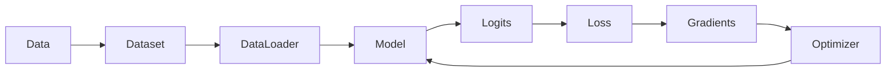

<section class="hub-hero" markdown>

DANIEL ZURITA · LEARNING REFERENCE

# Understand the workflow. Build the model.

A visual, practical PyTorch reference built from original explanations, executable examples, and projects. Start with the complete Fundamentals collection, then use the concept and project libraries whenever you need a focused answer.

[Start PyTorch Fundamentals](courses/fundamentals/index.md){ .md-button .md-button--primary }
[Open the 10-minute review](courses/fundamentals/quick-review.md){ .md-button }

</section>

## The complete mental model

Every training project is a variation of this loop. The model changes, the data changes, and the evaluation becomes more sophisticated—but the core flow remains recognizable.

<article class="feature-card" markdown>

### Courses

Read a structured collection in learning order, beginning with tensors and ending with reliable model evaluation.

[Open Fundamentals →](courses/fundamentals/index.md)

</article>

<article class="feature-card" markdown>

### Concepts

Return to one focused explanation: tensor shapes, the training loop, convolution, or generalization.

[Browse concepts →](concepts/index.md)

</article>

<article class="feature-card" markdown>

### Projects

See how the pieces connect in regression, handwriting recognition, robust data loading, and nature classification.

[Explore projects →](projects/index.md)

</article>

<article class="feature-card" markdown>

### Reference

Use the cheatsheet, error guide, and glossary while writing or debugging code.

[Open reference →](reference/index.md)

</article>

!!! info "A library, not a tracker"
    This site stores no course progress, completion state, accounts, analytics, or personal learning history. New material is added only when it is useful enough to publish.

## Featured original projects

| Project | Core question | What it demonstrates |
| --- | --- | --- |
| [Nonlinear regression](projects/regression.md) | When does a linear model stop being enough? | Tensors, autograd, loss, optimization |
| [EMNIST letter classifier](projects/emnist.md) | Why does image structure matter? | Dense baseline, CNN, distribution shift |
| [Robust image pipeline](projects/robust-image-pipeline.md) | How do we stop data problems from breaking training? | Custom Dataset, transforms, validation |
| [Nature CNN](projects/nature-cnn.md) | How do we recognize and reduce overfitting? | CNN blocks, regularization, diagnostics |

## How to use this hub

1. Read the [quick review](courses/fundamentals/quick-review.md) before an exercise or interview.
2. Follow the full [Fundamentals course map](courses/fundamentals/index.md) when learning in depth.
3. Open a [concept](concepts/index.md) when one mechanism is unclear.
4. Use the [common errors guide](reference/common-errors.md) when code fails.
5. Study a [project](projects/index.md) to connect the individual pieces.

