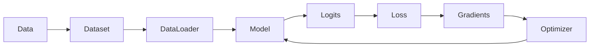

<section class="hub-hero" markdown>

DANIEL ZURITA · LEARNING REFERENCE

# Understand the workflow. Return when you need it.

A visual, practical PyTorch reference built from original explanations, executable examples, and complete projects. Use it to understand a mechanism, refresh an idea you have already seen, or connect code to a real dataset, model, and result.

[Browse the knowledge collections](collections/foundations.md){ .md-button .md-button--primary }
[Open the quick reference](courses/fundamentals/quick-review.md){ .md-button }

</section>

## The complete mental model

Every training project is a variation of this loop. The model changes, the data changes, and the evaluation becomes more sophisticated—but the core flow remains recognizable.

<article class="feature-card" markdown>

### Collections

Four connected collections gather the important ideas from first tensors to reliable CNNs—without a required order or progress system.

[Browse collections →](collections/foundations.md)

</article>

<article class="feature-card" markdown>

### Concepts

Return to one focused explanation: tensor shapes, the training loop, convolution, or generalization.

[Browse concepts →](concepts/index.md)

</article>

<article class="feature-card" markdown>

### Complete projects

Run real, downloadable data projects that save predictions, curves, metrics, confusion matrices, and checkpoints locally.

[Explore projects →](projects/index.md)

</article>

<article class="feature-card" markdown>

### Reference

Use the cheatsheet, error guide, and glossary while writing or debugging code.

[Open reference →](reference/index.md)

</article>

!!! info "A reference, not a course platform"
    This site stores no progress, completion state, accounts, analytics, or personal learning history. Open the topic that answers your question; there is no required sequence.

## Featured original projects

| Project | Core question | What it demonstrates |
| --- | --- | --- |
| [Nonlinear regression](projects/regression.md) | When does a linear model stop being enough? | Tensors, autograd, loss, optimization |
| [EMNIST letter classifier](projects/emnist.md) | Why does image structure matter? | Download, train, predictions, confusion matrix |
| [Robust image pipeline](projects/robust-image-pipeline.md) | How do we stop data problems from breaking training? | Real folder data, diagnostics, training artifacts |
| [Nature CNN](projects/nature-cnn.md) | How do we recognize and reduce overfitting? | CIFAR-100 download, CNN, validation artifacts |

## How to use this hub

1. Read the [quick reference](courses/fundamentals/quick-review.md) before an exercise or interview.
2. Browse the [collections](collections/foundations.md) when you want the whole connection.
3. Open a [concept](concepts/index.md) when one mechanism is unclear.
4. Use the [common errors guide](reference/common-errors.md) when code fails.
5. Study a [project](projects/index.md) to connect the individual pieces.
