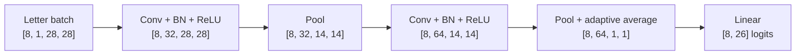

# Project: EMNIST letter classifier

## The question

Why does keeping an image as a grid usually give a model more useful structure than flattening it immediately?

## What to remember

A dense baseline can classify pixels, but it loses the explicit neighbor relationship between strokes. A convolutional model reuses small local detectors across the image before turning the result into 26 logits.

## Key code

```python
self.features = nn.Sequential(
    nn.Conv2d(1, 32, 3, padding=1),
    nn.BatchNorm2d(32), nn.ReLU(), nn.MaxPool2d(2),
    nn.Conv2d(32, 64, 3, padding=1),
    nn.BatchNorm2d(64), nn.ReLU(), nn.MaxPool2d(2),
    nn.AdaptiveAvgPool2d((1, 1)),
)
self.classifier = nn.Linear(64, classes)
```

The convolution blocks preserve the two-dimensional view while pooling reduces spatial size. `AdaptiveAvgPool2d((1, 1))` creates a stable 64-feature boundary before classification.

## Evidence and visual

This is a verified architecture and shape map, not a trained-accuracy claim. The retained smoke test confirms that both the dense and CNN variants return `[batch, 26]` logits for `[batch, 1, 28, 28]` input.



## Interactive check

<div class="interactive-panel" data-shape-tracer>
  <div class="interactive-heading">EMNIST spatial-size tracer</div>
  <label>Input width and height <input type="number" min="8" value="28" data-spatial-size></label>
  <label>2× pooling blocks <input type="range" min="0" max="5" value="2" data-pool-blocks></label>
  <button type="button" data-trace-shape>Trace shape</button>
  <output data-shape-output aria-live="polite"></output>
</div>

## Run it yourself

```bash
python examples/emnist_model.py
```

It runs deterministic shape checks and prints parameter counts. A full EMNIST training run remains separate so the documentation workflow does not download data or imply a benchmark result.

## Complete source

??? note "Open the maintained runnable script"
    ```python
    --8<-- "examples/emnist_model.py"
    ```
