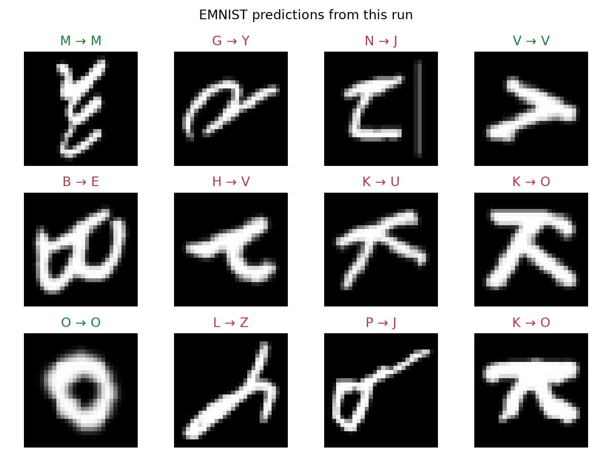
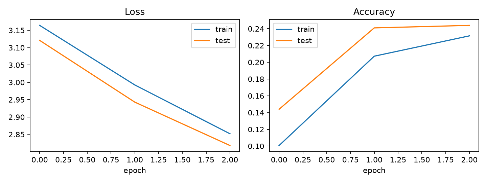
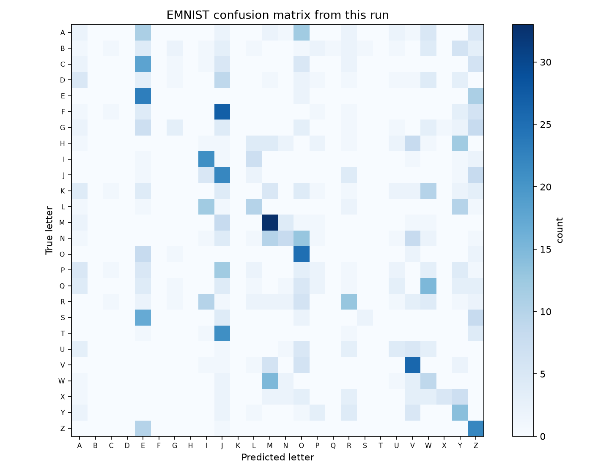

# Project: EMNIST letter classifier

Follow a letter from a one-channel image through convolution to 26 class scores, then inspect the model's mistakes.
{ .page-lead }

## The question

Why does keeping an image as a grid usually give a model more useful structure than flattening it immediately?

## What to remember

A dense baseline can classify pixels, but it loses the explicit neighbor relationship between strokes. A convolutional model reuses small local detectors across the image before turning the result into 26 logits.

## Key code

```python
self.features = nn.Sequential(
    nn.Conv2d(1, 32, 3, padding=1),
    nn.BatchNorm2d(32), nn.ReLU(), nn.MaxPool2d(2),
    nn.Conv2d(32, 64, 3, padding=1),
    nn.BatchNorm2d(64), nn.ReLU(), nn.MaxPool2d(2),
    nn.AdaptiveAvgPool2d((1, 1)),
)
self.classifier = nn.Linear(64, classes)
```

The convolution blocks preserve the two-dimensional view while pooling reduces spatial size. `AdaptiveAvgPool2d((1, 1))` creates a stable 64-feature boundary before classification.

**Trace it:** an EMNIST batch enters as `[N, 1, 28, 28]`. The two convolutions grow channels to 32 and then 64; the two pools shrink 28 → 14 → 7. Adaptive pooling gives `[N, 64, 1, 1]`, flattening gives `[N, 64]`, and the classifier returns `[N, 26]`. Explain each change before running the full script.

## Evidence and visual

The included full project downloads the public EMNIST Letters split through TorchVision, trains this CNN, and saves its own predictions, confusion matrix, curves, checkpoint, and JSON metrics. The shape map remains useful before any dataset is downloaded.

### Reproduced CPU run

Historical evidence: the images below come from the original CPU configuration, which evaluated test at each epoch: seed `42`, 4,000 training examples, 1,000 test examples, and three epochs. It reached `24.4%` test accuracy. This intentionally small configuration demonstrates the full workflow and its artifacts; it is not presented as a strong handwriting benchmark.

{ width="1280" height="960" }

{ width="1440" height="544" }

{ width="1440" height="1120" }

<div class="recall-flow" role="group" aria-label="Input to output">
<div><b>Letter batch</b><code>[8,1,28,28]</code><small>8 grayscale images</small></div>
<div><b>Conv + ReLU</b><code>[8,32,28,28]</code><small>32 feature maps</small></div>
<div><b>Pool</b><code>[8,32,14,14]</code><small>halve spatial size</small></div>
<div><b>Conv + pool</b><code>[8,64,7,7]</code><small>64 feature maps</small></div>
<div><b>Adaptive avg + flatten</b><code>[8,64]</code><small>one value per channel</small></div>
<div><b>Classifier</b><code>[8,26]</code><small>26 raw letter scores</small></div>
</div>
<p class="visual-caption">Illustration: shapes and operations, not measured model performance.</p>


## Interactive check

<div class="interactive-panel" data-shape-tracer>
  <div class="interactive-heading">EMNIST spatial-size tracer</div>
  <label>Input width and height <input type="number" min="8" value="28" data-spatial-size></label>
  <label>2× pooling blocks <input type="range" min="0" max="5" value="2" data-pool-blocks></label>
  <button type="button" data-trace-shape>Trace shape</button>
  <output data-shape-output aria-live="polite"></output>
</div>

## Run it yourself

```bash
python examples/emnist_model.py
```

The default small run downloads data when needed, splits a 4,000-image pool into 3,200 training and 800 validation images, trains for three epochs, and writes artifacts to `artifacts/emnist/`. It uses CUDA if available; add `--device cpu` to force CPU. For a longer GPU run:

```bash
python examples/emnist_model.py --full --device cuda
```

Use `--smoke-test` to verify model shapes without downloading data.

## Validation and final test

The maintained script now splits the training pool with a fixed seed (`--validation-fraction 0.2`). It chooses the minimum validation-loss checkpoint, restores those weights, then evaluates the official test split at the end. The saved report records disjoint source indices and `best_epoch`; the checkpoint records normalization and class order. Early stopping would end training earlier and is a separate decision.

The default 4,000-image training pool becomes 3,200 training and 800 validation images; the separate test subset remains 1,000 images. The retained figures and 24.4% result above describe the original three-epoch configuration, which evaluated test during training. They are historical evidence and have not been relabeled as validation results or regenerated by this change.

## Complete source

??? note "Open the maintained runnable script"
    ```python
    --8<-- "examples/emnist_model.py"
    ```

The script imports the shared checkpoint/split helper from `examples/validation_patterns.py`; keep both files when running outside a full checkout.

??? note "Shared deterministic split and best-checkpoint helper"
    ```python
    --8<-- "examples/validation_patterns.py"
    ```
