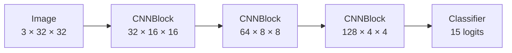

# Project: Nature CNN and overfitting

## The question

How do reusable CNN blocks and validation curves help you separate genuine learning from memorization?

## What to remember

Regularization is not one setting. It is the combination of a stable data split, training-only augmentation, model capacity, weight decay, dropout, and selecting a checkpoint by validation behavior.

## Key code

```python
class CNNBlock(nn.Module):
    def __init__(self, in_channels, out_channels):
        super().__init__()
        self.block = nn.Sequential(
            nn.Conv2d(in_channels, out_channels, 3, padding=1),
            nn.BatchNorm2d(out_channels), nn.ReLU(), nn.MaxPool2d(2),
        )
```

The reusable block makes each transformation explicit: learn local patterns, normalize activation statistics, add nonlinearity, then reduce spatial size. Reuse makes shape debugging and comparisons easier.

## Evidence and visual

The full project downloads public CIFAR-100 through TorchVision, filters 15 nature classes, trains this CNN, and writes its own prediction grid, confusion matrix, curves, checkpoint, and JSON metrics. The architecture map explains the shape contract before a run is started.



## Interactive check

<div class="interactive-panel curve-lab" data-curve-lab>
  <div class="interactive-heading">Illustrative train–validation gap</div>
  <label>Illustrative regularization strength <input type="range" min="0" max="100" value="35" data-regularization></label>
  <canvas width="560" height="240" data-curve-canvas aria-label="Illustrative training and validation loss curves, not measured Nature CNN data"></canvas>
  <output data-curve-output aria-live="polite"></output>
  <small>This visual explains a pattern to look for; it is not measured CIFAR-100 performance.</small>
</div>

## Run it yourself

```bash
python examples/nature_cnn.py
```

The default CPU-first run uses 120 images per selected class for four epochs and writes artifacts to `artifacts/nature-cnn/`. For a longer GPU run over the complete selected dataset:

```bash
python examples/nature_cnn.py --full --device cuda
```

Use `--smoke-test` to verify the model shape without downloading data.

## Complete source

??? note "Open the maintained runnable script"
    ```python
    --8<-- "examples/nature_cnn.py"
    ```
