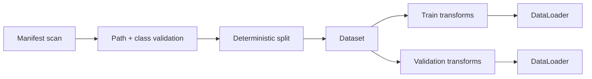

# Project: robust image pipeline

## Problem

Build an image ingestion layer that produces stable class ids, detects invalid files, separates random training augmentation from deterministic validation, and fails with useful diagnostics.

## Architecture

## Important decisions

- Sort class folders before assigning ids.
- Validate extensions and image readability during indexing.
- Log skipped paths with reasons.
- Convert every image to a declared color mode.
- Use a fixed split seed.
- Check class distribution after splitting.
- Keep augmentation out of validation.

## Failure policy

Silently replacing a corrupt sample with a different class can distort metrics. This implementation validates the index early and offers a bounded `None` + `collate_fn` path for datasets that must continue operating.

## Reproducibility

`examples/robust_dataset.py` creates temporary valid and corrupt fixtures, verifies that the corrupt file is reported, and checks the output tensor contract.

