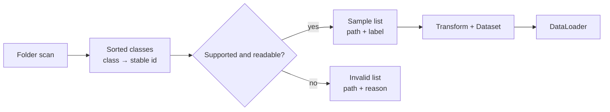

# Project: robust image pipeline

## The question

How can a dataset tell you about bad input before a training run turns it into a vague error or misleading metric?

## What to remember

Data quality is part of model quality. Define class ids deterministically, inspect files when indexing, record failures, and keep random augmentation outside validation.

## Key code

```python
self.class_names = sorted(path.name for path in self.root.iterdir() if path.is_dir())
self.class_to_index = {name: index for index, name in enumerate(self.class_names)}

try:
    with Image.open(path) as image:
        image.verify()
except Exception as error:
    self.invalid.append(InvalidImage(path, type(error).__name__))
    continue
```

Sorting protects the class-to-index contract. `verify()` checks readability during indexing, so a corrupt file is reported before a batch reaches the model.

## Evidence and visual

This is a verified validation flow. The retained fixture test creates two valid images and one corrupt JPEG; it confirms that the corrupt path is recorded instead of becoming a silent training sample.



## Interactive check

<div class="interactive-panel" data-pipeline-lab>
  <div class="interactive-heading">Manifest decision check</div>
  <label>Candidate file
    <select data-pipeline-file>
      <option value="valid">rose/valid.png</option>
      <option value="corrupt">bee/broken.jpg</option>
      <option value="unsupported">notes/readme.txt</option>
    </select>
  </label>
  <output data-pipeline-output aria-live="polite"></output>
</div>

## Run it yourself

```bash
python examples/robust_dataset.py
```

It creates temporary fixtures, checks the output tensor contract, and reports the number of valid and invalid samples.

## Complete source

??? note "Open the maintained runnable script"
    ```python
    --8<-- "examples/robust_dataset.py"
    ```
