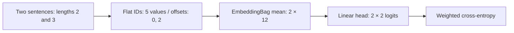

# Project: variable-length text classifier

Train a small classifier from original image-description phrases. Follow vocabulary → token IDs → offsets → mean embeddings → class scores.
{ .page-lead }

## What to remember

Different-length sentences do not require a fixed padded matrix. `EmbeddingBag` accepts concatenated IDs plus the start offset of each sentence and returns one pooled vector per sentence.

This is an inexpensive baseline, not a contextual language model. It combines the course's tokenization, vocabulary, collation, pooling and class-weight ideas without external course helpers or pretrained downloads.

## Important code

```python
ids = torch.tensor([2, 3, 4, 5, 6], dtype=torch.long)
offsets = torch.tensor([0, 2], dtype=torch.long)
embedding = nn.EmbeddingBag(vocab_size, 12, mode="mean", padding_idx=0)
head = nn.Linear(12, 2)
logits = head(embedding(ids, offsets))  # [2, 2]
```

The first sentence is `[2,3]`, the second is `[4,5,6]`. Their lengths differ, but both produce a 12-value vector. Offsets use start positions; the default API does not require a final ending offset.



| Choice | This example | Why it matters |
| --- | --- | --- |
| Vocabulary | Sorted words from training text only | Prevents validation text from defining the representation. |
| Reserved IDs | Padding `0`, unknown `1` | Unknown words and padding mean different things. |
| Empty input | One unknown token | Makes the empty-input policy explicit. |
| Collation | Flat IDs, start offsets and integer labels | Keeps variable-length batching on CPU. |
| Class weights | Inverse training counts, aligned with IDs | Gives the rarer class more weight in the loss. |
| Pooling | Mean | Balances length but discards word order. |

The tiny training set has six positive and two negative descriptions. It computes weights `[2.0, 2/3]` in label order. More weight changes the loss priorities; it does not guarantee better minority-class predictions.

## Check the representation

If you reverse the words in a sentence, its mean-pooled vector stays the same. “Dog bites person” and “person bites dog” therefore cannot be distinguished by this baseline.

A padded `nn.Embedding` alternative needs a mask when computing a manual mean. Compare its padding cost below; the script itself uses offsets and no padding:

<div class="interactive-panel" data-padding-lab>
  <div class="interactive-heading">Offsets avoid these padding positions</div>
  <label>Sequence lengths <input value="2,3" data-sequence-lengths aria-label="Comma separated positive token counts"></label>
  <label>Fixed maximum <input type="number" min="1" max="4096" value="8" data-fixed-length></label>
  <output data-padding-output aria-live="polite"></output>
  <small>Synthetic token counts; this compares padded batching, not measured runtime.</small>
</div>

## Run and inspect

```bash
python examples/text_bags.py
python examples/text_bags.py --epochs 40 --output artifacts/my-text-run
```

The offline CPU run saves `predictions.json` and `text-model.pt` under the output directory. Inspect the token map, class weights, validation history and predictions for four new combinations of words. The checkpoint includes the vocabulary, label names and tokenization/empty-input policy.

These toy phrases demonstrate the data flow. Their validation scores are not a sentiment benchmark and do not prove useful performance on natural language. For a real application, enlarge the dataset and inspect per-class recall and macro F1.

**Try changing:** add a new training phrase, rerun vocabulary construction, then compare a new word with an unknown word. If order changes the correct label, move to an order-aware or contextual model rather than tuning a bag of words indefinitely.

[Review tokenization and embeddings](../guides/text/tokens-embeddings.md) · [Review classifiers and fine-tuning](../guides/text/text-classifiers.md)

## Complete source

??? note "Open the maintained runnable script"
    ```python
    --8<-- "examples/text_bags.py"
    ```

??? note "Open the shared variable-length collator"
    ```python
    --8<-- "examples/recall_patterns.py:bag-collate"
    ```

API reference: [EmbeddingBag inputs, offsets and padding](https://docs.pytorch.org/docs/stable/generated/torch.nn.EmbeddingBag.html).
