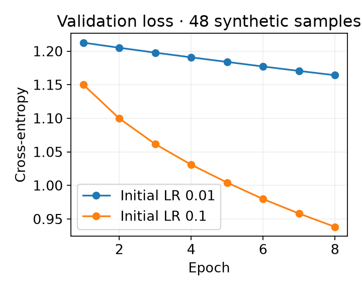
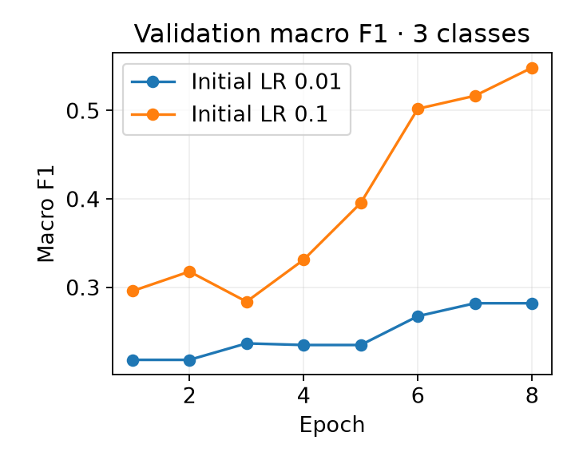
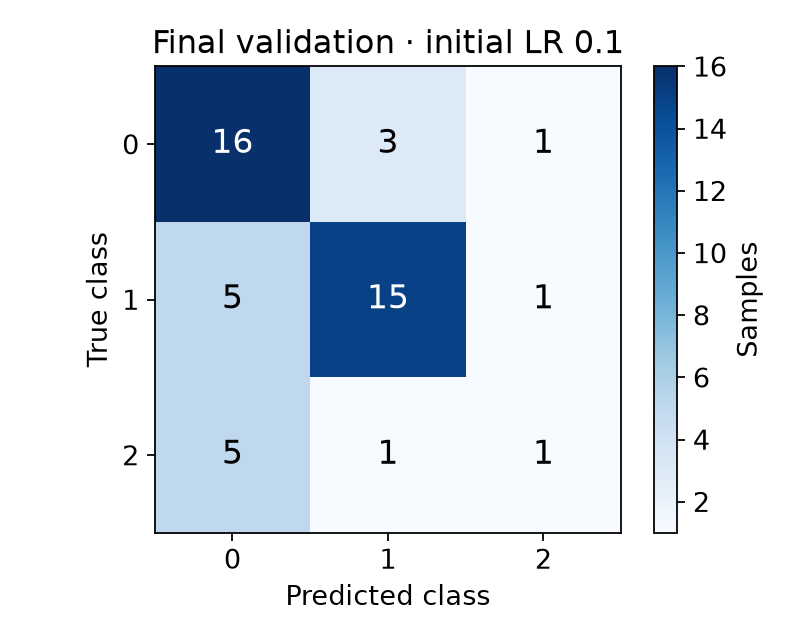

# Project: controlled training comparison

Run two learning rates fairly and inspect the validation loss, accuracy, macro F1 and per-class recall after each epoch.
{ .page-lead }

## What to remember

A comparison is useful only when the split, starting model and training budget agree. This script creates one initial state and restores it for each trial. Each trial also gets the same seeded batch order.

It connects Course 2 metrics, schedules, search discipline and accumulation. The comparison is deliberately a two-value search using ordinary PyTorch; Optuna is useful for larger searches, but is not needed to understand the objective.

## Important code

```python
model.load_state_dict(initial)
loader = DataLoader(train, batch_size=16, shuffle=True,
                    generator=torch.Generator().manual_seed(23))
optimizer = torch.optim.SGD(model.parameters(), lr=lr, weight_decay=1e-3)
scheduler = torch.optim.lr_scheduler.ReduceLROnPlateau(
    optimizer, mode="min", factor=0.5, patience=1)

# Repeat for each epoch:
train_accumulated(model, loader, optimizer, "cpu", microbatches=3)
measured = metrics(model, validation)
scheduler.step(measured["loss"])
```

The loss controls the plateau scheduler and selects the final comparison winner. Accuracy and macro F1 describe different aspects of the same predictions; they are not averaged together into an invented score.

| Setting | This example | Why it matters |
| --- | --- | --- |
| Learning rate | `0.01` and `0.1` | Changes the size of SGD updates; compare the full histories. |
| Microbatch / accumulation | `16 × 3` | Up to 48 samples per optimizer update on one device. |
| Training samples | 133 | The last update has 37 samples; normalization uses that actual count. |
| Plateau patience / factor | `1 / 0.5` | After the allowed non-improving checks, reduce LR by half. Eight short epochs need not trigger a reduction. |
| Metric aggregation | One confusion matrix for validation | Avoids giving a short batch the same weight as a full one. |

The model has no BatchNorm or Dropout, which makes the accumulation mechanism easier to inspect. The helper averages gradients by the actual group sample count.

## Check the effective batch

<div class="interactive-panel" data-accumulation-lab>
  <div class="interactive-heading">Samples per optimizer update</div>
  <label>Microbatch <input type="number" min="1" value="16" data-microbatch></label>
  <label>Accumulation steps <input type="number" min="1" value="3" data-accumulation></label>
  <label>Samples per epoch <input type="number" min="1" value="133" data-epoch-samples></label>
  <output data-accumulation-output aria-live="polite"></output>
  <small>Single-device arithmetic; a final incomplete group is smaller.</small>
</div>

## Run and inspect

```bash
python examples/training_comparison.py
python examples/training_comparison.py --epochs 20 --output artifacts/my-comparison
```

The offline CPU run saves `comparison.json` under the selected output directory. For each trial, inspect `lr_used` versus `lr_next`, loss, macro F1, per-class recall and the confusion matrix. Rows are true classes; columns are predictions.

This seeded synthetic problem demonstrates controlled comparison. Its scores are not a benchmark for a real application, and the selected LR may change with a different dataset or budget. Keep a separate test split for final assessment in a real experiment.

**Try changing:** compare a wider LR range, then change only accumulation steps. Does a different update count alter learning even though the number of epochs stayed fixed?

[Review metrics and tuning](../guides/training/training-quality.md) · [Review accumulation](../guides/training/efficient-training.md#gradient-accumulation)

## Retained CPU execution

These are measured outputs of the small synthetic run on 2026-10-01: PyTorch 2.14.0+cu130, seed 17, two CPU threads, 133 training and 48 validation samples, eight epochs. They demonstrate the mechanism, not real-world classifier quality.







The lower final validation loss selects initial LR **0.1**: loss **0.9382**, accuracy **66.7%**, macro F1 **0.5486**. The matrix includes all 48 validation predictions; rows are truth and columns predictions. Both trials keep their initial LR during this short run: the plateau condition is not reached.

Class 2 is recognized in only **1 of 7** validation examples (14.3% recall), despite 66.7% overall accuracy. This is why the per-class matrix and recall belong beside the winning scalar score.

The [retained comparison report](../assets/data/recall-2026-10-01/comparison.json) contains every epoch and count.

### Optional physical batch versus accumulation benchmark

```bash
python examples/training_comparison.py --benchmark --device cpu
python examples/training_comparison.py --benchmark --device auto
# Optional on compatible CUDA hardware; also measures accumulated AMP FP16:
python examples/training_comparison.py --benchmark --device cuda
```

CPU is the default. Every variant starts from the same parameters and sample order: effective batch 48, three updates, final group 37. One warmup epoch is discarded; the next five complete epochs are timed. The timed region includes iteration, transfers, forward/backward and updates; model construction is outside it.

| Measured CPU variant | Median epoch | Throughput | CUDA memory |
| --- | --- | --- | --- |
| physical FP32 | 1.06 ms | 125,059 samples/s | N/A on CPU |
| accumulated FP32 | 1.90 ms | 69,930 samples/s | N/A on CPU |

Maximum FP32 parameter difference after the final incomplete group: `1.49e-08`. This tiny CPU experiment is sensitive to overhead; it does not establish a speed advantage on other models or devices. CUDA/AMP was unavailable in this session. On CUDA, `benchmark.json` also records peak allocated CUDA memory (including resident model state), free/total CUDA memory before trials, GPU name, optimizer/model configuration, precision, timing samples and throughput. [Retained benchmark configuration and measurements](../assets/data/recall-2026-10-01/benchmark.json).

## Complete source

??? note "Open the maintained runnable script"
    ```python
    --8<-- "examples/training_comparison.py"
    ```

The shared `train_accumulated` helper comes from `examples/recall_patterns.py`:

??? note "Open the accumulation helper"
    ```python
    --8<-- "examples/recall_patterns.py:accumulation"
    ```

API reference: [ReduceLROnPlateau](https://docs.pytorch.org/docs/stable/generated/torch.optim.lr_scheduler.ReduceLROnPlateau.html).
