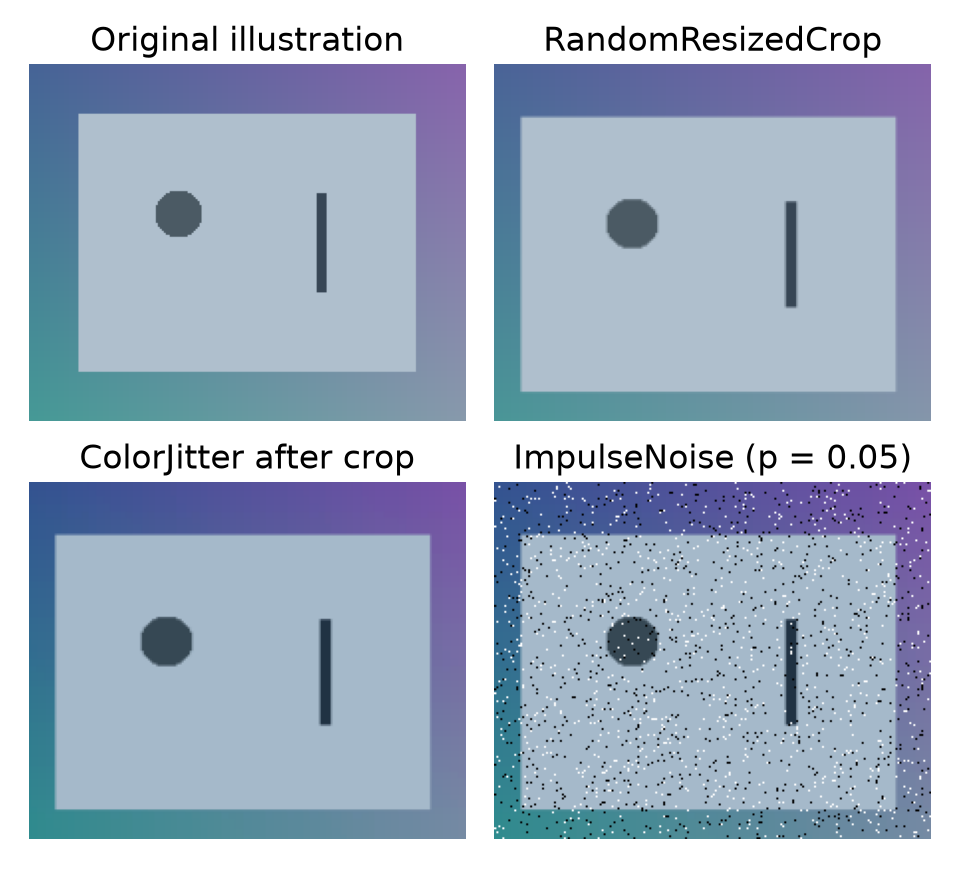

# Project: image augmentation and head training

Connect image variation, impulse noise and a replacement classification head while keeping the backbone fixed.
{ .page-lead }

## What to remember

Transfer learning reuses pretrained features; head-only training learns a new output mapping. Freezing parameters alone does not freeze BatchNorm statistics. This script holds the backbone in evaluation mode and trains only the new head.

The default run uses synthetic images and a **random** ResNet backbone, so it demonstrates the mechanics without downloads. The optional `--data … --pretrained` run uses ImageNet weights and your own image folders for actual transfer learning.

## Important code

```python
model = resnet18(weights=weights)
model.requires_grad_(False)
model.fc = nn.Linear(model.fc.in_features, len(classes))
optimizer = torch.optim.Adam(model.fc.parameters(), lr=1e-3)

# Repeat at the start of each head-only training epoch:
model.eval()       # keep backbone BatchNorm statistics fixed
model.fc.train()   # the new head is the part being trained
```

For your image folders, the training transform follows this order:

```python
train_transform = transforms.Compose([
    transforms.RandomResizedCrop(224),
    transforms.RandomHorizontalFlip(),
    transforms.ToTensor(),
    ImpulseNoise(noise),
    transforms.Normalize(mean, std),
])
```

`ImpulseNoise(0.02)` replaces about 2% of spatial pixels with black or white in expectation, using one mask shared by RGB channels. It runs on floats in 0–1, before normalization. The amount varies by sample. This is the salt-and-pepper mechanism studied in the course; it is not a complete camera-noise model.

| Decision | Training | Validation |
| --- | --- | --- |
| Geometry | Random crop and optional flip | Fixed resize and centre crop |
| Noise | Optional selected severity | Clean, deterministic input |
| Normalization | Matching channel mean/std | The same channel mean/std |
| Layers | New `fc` head learns | All layers evaluate |

Flips/crops must preserve your labels. For a separate robustness evaluation, create a fixed noisy validation set rather than randomizing ordinary validation.

## Visual noise check

<div class="interactive-panel noise-lab" data-noise-lab>
  <div class="interactive-heading">Inspect a synthetic target</div>
  <label>Noise <select data-noise-kind><option value="impulse">Salt and pepper</option><option value="gaussian">Gaussian comparison</option></select></label>
  <label>Amount <input type="range" min="0" max="30" value="2" data-noise-amount></label>
  <div class="noise-pair">
    <figure><figcaption>Clean</figcaption><canvas width="240" height="160" data-noise-clean role="img" aria-label="Clean synthetic target"></canvas></figure>
    <figure><figcaption>Corrupted</figcaption><canvas width="240" height="160" data-noise-changed role="img" aria-label="Synthetic target with adjustable noise"></canvas></figure>
  </div>
  <output data-noise-output aria-live="polite"></output>
  <small>Illustration only. The runnable script adds impulse noise; Gaussian mode is an explanatory comparison.</small>
</div>

## Run and inspect

```bash
python examples/vision_head.py
```

This small CPU run writes `report.json` and `head-model.pt` under `artifacts/vision-head/`. The report explicitly records random weights and synthetic data. Its accuracy has no transfer-quality meaning.

For real transfer learning, provide separate `my-images/train/class-name/` and `my-images/val/class-name/` folders containing the same class names:

```bash
python examples/vision_head.py --data my-images --pretrained --epochs 5 --noise 0.02
```

The first pretrained run may download weights. The example stays on CPU and zero DataLoader workers for portability. The real-image/pretrained branch is provided for study; the local verification used offline data, not a new transfer-learning benchmark.

The checkpoint saves the head and backbone state together with class names, validation preprocessing, original backbone weight identity and noise policy. After adapting a head, ImageNet's original class names no longer describe its outputs.

**Try changing:** compare `--noise 0` with `--noise 0.02` on the same split. Do not expect noise to help every task. To fine-tune late layers, explicitly unfreeze them and rebuild the optimizer.

[Review transforms and noise](../guides/vision/augmentation.md) · [Review transfer stages](../guides/vision/pretrained-models.md#train-the-head-then-fine-tune)

## What the retained execution shows

{ width="960" height="880" }

**Seeded transform execution on an original illustration.** The panels apply actual TorchVision crop and colour transforms, followed by the maintained `ImpulseNoise` code. This scene is for inspecting transforms; the head-training run uses seeded random images. Training-only transformations preserve labels only when the selected change is plausible for your task. [Exact transform order, shape and ranges](../assets/data/recall-2026-10-01/transforms.json).

The retained two-epoch CPU head run uses **random ResNet18 weights**, 24 synthetic training images, 12 validation images and three synthetic labels. Random pixels have no useful class signal; its validation score does not demonstrate transfer learning.

| Before/after check | Observed in saved state |
| --- | --- |
| Frozen backbone parameters (11,176,512 values) | Unchanged |
| BatchNorm running buffers | Unchanged: backbone remains in evaluation mode |
| Trainable classifier (1,539 values) | Changed after optimizer updates |

The script verifies these checks against a cloned initial state. [Retained head report](../assets/data/recall-2026-10-01/report.json). To learn useful features for your own classes, supply labelled `train/` and `val/` folders; `--pretrained` optionally downloads ImageNet weights and uses their preprocessing contract. A random frozen backbone is a mechanics demo, not pretrained transfer learning.

## Complete source

??? note "Open the maintained runnable script"
    ```python
    --8<-- "examples/vision_head.py"
    ```

??? note "Open the shared impulse-noise transform"
    ```python
    --8<-- "examples/recall_patterns.py:salt-pepper"
    ```

API reference: [ResNet18 and its weight preprocessing](https://docs.pytorch.org/vision/stable/models/generated/torchvision.models.resnet18.html).


??? note "Visual-generation source · runnable with the retained reports"
    ```python
    --8<-- "scripts/render_recall_evidence.py"
    ```

Run `python scripts/render_recall_evidence.py` from the repository root to regenerate these new explanatory charts and transform panels. It reads the public retained reports and leaves the legacy regression and EMNIST images intact.
