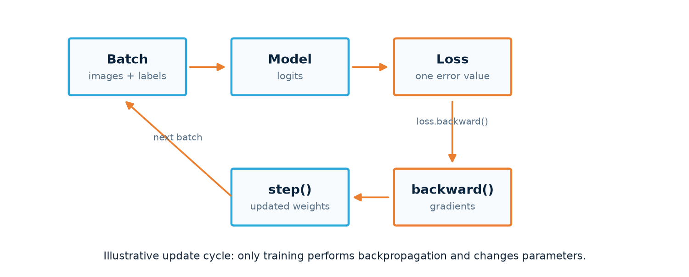

# Start here: build one small model, then understand the pieces

PyTorch is easiest to retain when you can place each line of code in one concrete loop. Start with this path if you are new to the library or returning after a break. It is a recommended order, not a course to complete.

## The one idea to keep in view

An image-classification model repeats the same cycle for many batches:

1. Prepare an input tensor and its label.
2. Let the model produce a prediction (raw **logits**).
3. Compare logits with the correct label to calculate **loss**.
4. Use `loss.backward()` to calculate gradients.
5. Use `optimizer.step()` to change the weights.
6. Evaluate separately on data the model did not update from.

## Take this first pass

| Start with | You should be able to explain | Then open |
| --- | --- | --- |
| [1. Tensors and a first model](first-model.md) | What a tensor shape means; why a linear model needs an activation for curved patterns | [Nonlinear regression](../projects/regression.md) |
| [2. A complete classifier](first-classifier.md) | How `Dataset`, `DataLoader`, model, loss, optimizer, and evaluation divide the work | [EMNIST letters](../projects/emnist.md) |
| [3. CNNs for images](cnn.md) | What convolution, feature maps, pooling, and classifier boundaries do | [Nature CNN](../projects/nature-cnn.md) |

## When you get stuck

- A shape error: inspect [`[batch, channels, height, width]`](../concepts/tensor-shapes.md).
- A training loop you do not trust: read the [annotated training loop](../concepts/training-loop.md).
- An image folder that does not behave: start with [data and transforms](../courses/fundamentals/data-pipeline.md).
- A model that learns training data but fails validation: use [overfitting and regularization](../courses/fundamentals/overfitting.md).

!!! tip "Do not memorize the whole API"
    Be able to point to where a batch is created, where logits appear, where loss is calculated, where weights change, and where evaluation begins. The names and syntax are easy to look up once this map is clear.
